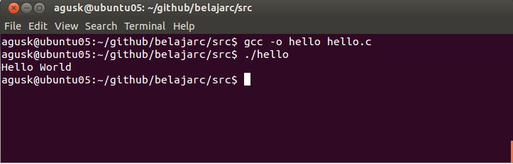

# Hello World

Ini merupakan hal yang pertama yang dilakukan ketikan membuat program awal yaitu Hello World. Disini kita menggunakan Ubuntu dan compiler GCC. Buat file dengan nama **hello.c** dan tulis kode program dibawah ini.

    #include <stdio.h>

    int main()
    {
        printf("Hello World\n");
    	return 0;
    }

Silakan unduh disini [hello.c](../src/hello.c).

Selanjutnya untuk kompilasi dapat dilakukan sebagai berikut.

    $ gcc -o hello hello.c

Untuk eksekusinya dapat dilakukan sebagai berikut.

    $ ./hello
    

Contoh hasilnya.

