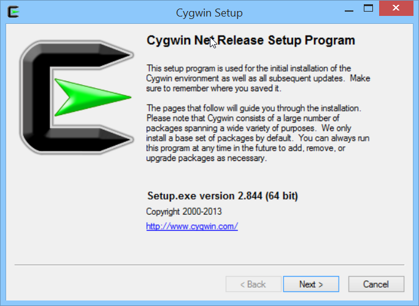
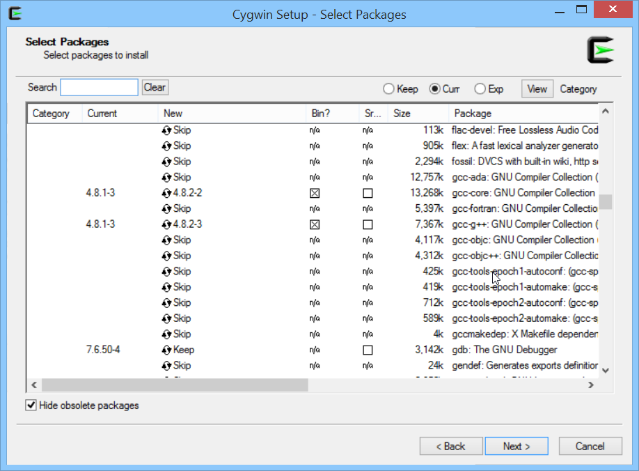
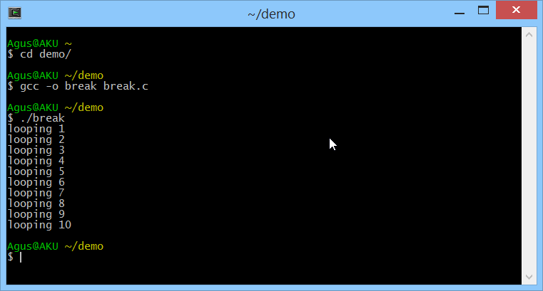

# Development Tools dan Compilers

Ada banyak tool yang dapat digunakan untuk membuat program bahasa C atau C++. Berikut ini daftarnya.

* Visual C++, [http://www.visualstudio.com/en-us/products/visual-studio-express-vs.aspx](http://www.visualstudio.com/en-us/products/visual-studio-express-vs.aspx)
* Eclipse, [https://www.eclipse.org/](https://www.eclipse.org/)
* Netbeans, [https://netbeans.org/](https://netbeans.org/)
* Borland C++, [http://edn.embarcadero.com/article/20633](http://edn.embarcadero.com/article/20633)
* Intellij IDE, [http://www.jetbrains.com/idea/](http://www.jetbrains.com/idea/)
* Dev C++, [http://www.bloodshed.net/devcpp.html](http://www.bloodshed.net/devcpp.html)
* Qt Editor, [http://qt-project.org/](http://qt-project.org/)

Pada tutorial ini penulis akan menggunakan compiler **GCC**.

## GCC Compiler

Untuk platform Linux Debian/Ubuntu, anda dapat menginstall dengan menulis perintah ini di terminal

    $ sudo apt-get update
    $ sudo apt-get install build-essential

Selanjutnya anda dapat menggunakan GCC ini pada Linux Debian/Ubuntu.

## GCC Pada Windows

Bagi anda yang memiliki platform Windows dan ingin menggunakan compiler GCC maka anda dapat menginstall cygwin. Ini dapat diunduh disini [http://www.cygwin.com/](http://www.cygwin.com/) . Disini tersedia cygwin untuk x86 dan x64.

Setelah menginstallnya, anda install package gcc nya.

Kemudian pada bagian devel, pilih gcc, gdb dan make.

Jika selesai, kita akan mendapatkan terminal Cygwin dan melalui terminal kita dapat menggunakan GCC. Berikut ini contoh menggunakan GCC pada Cygwin.

