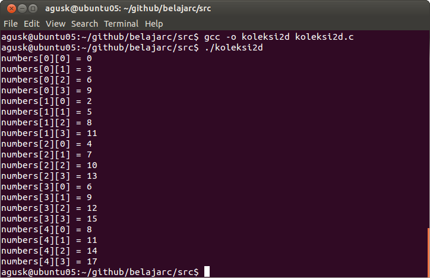

# Bekerja dengan Koleksi

## Deklarasi Koleksi

Secara umum, kita dapat mendeklarasikan array dengan satu dimensi sebagai berikut.

    int numbers[10];
    double saldo[5];

Disini terlihat kita **numbers** adalah array dengan panjang 10 dan **saldo** sebanyak 5.

## Initialisiasi Data

Kita juga dapat memberikan nilai ketika kita deklarasikan sebuah koleksi. Contohnya sebagai berikut.

    int numbers[10] = {12, 10, 5, 7, 2, 15, 28, 31, 21, 39 };
    char chars[5] = {'e', 't', 'k', 'a', 'm'};
    

## Akses Koleksi

Untuk mengakses objek koleksi, kita cukup memasukkan index dari data array tersebut. Jika array itu panjang 5 maka kita boleh memasukkan index dari 0 sampai 4. Semua dimulai dari angka 0.

Contoh ilustrasinya dapat dilihat pada kode program dibawah ini ([koleksi.c](../src/koleksi.c)).

    #include <stdio.h>
     
    int main ()
    {
    
        int numbers[10];
        int i;
    
        // isi data
        for(i=0;i<10;i++) {
            numbers[i] = i*2 + 5;
        }
    
        // menampilkan data
        for(i=0;i<10;i++) {
            printf("numbers[%d] = %d \n", i, numbers[i]);
        }
    
          
        return 0;
    }

Simpan dan lakukan kompilasi. Kemudian eksekusi.

    $ gcc -o koleksi koleksi.c
    $ ./koleksi

Contoh hasil eksekusinya dapat dilihat disini

## Multi Koleksi

Sebuah multi koleksi dapat dideklarasikan sebagai berikut.

    tipe_data nama_variable[m][n][p][q].....[..];

Contohnya kita memiliki koleksi dengan 2 dimensi.

    int data[5][4];
    

Guna memudahkan ilustrasi, kita membuat contoh program ([koleksi2d.c](../src/koleksi2d.c)).

    #include <stdio.h>
     
    int main ()
    {
    
        int numbers[5][4];
        int i,j;
    
        // isi data
        for(i=0;i<5;i++) {
            for(j=0;j<4;j++) {
                numbers[i][j] = i*2 + 3*j;
            }
    
        }
    
        // menampilkan data
        for(i=0;i<5;i++) {
            for(j=0;j<4;j++) {
                printf("numbers[%d][%d] = %d \n", i,j, numbers[i][j]);
            }
    
        }
    
          
        return 0;
    }

Simpan dan lakukan kompilasi dan eksekusi.

    $ gcc -o koleksi2d koleksi2d.c
    $ ./koleksi2d

Contoh hasilnya dapat dilihat disini.

