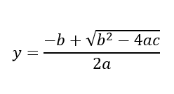

# Operasi Matematika

## Mengenal Library math.h

Pada sesi ini kita akan membahas mengenai operasi matematika dengan memanfaatkan library **math.h**. Header file ini dapat ditemui pada platform anda.

Untuk menggunakan library math ini, kita cukup deklarasikan header **math.h** kedalam program kita. Contohnya sebagai berikut

	#include <stdio.h>
	#include <math.h> 
	
	int main ()
	{
	    
	   return 0;
	}

Secara umum, library **math.h** menyediakan fungsi sebagai berikut:

* double acos(double x)
* double asin(double x)
* double atan(double x)
* double atan2(doubly y, double x)
* double cos(double x)
* double cosh(double x)
* double sin(double x)
* double sinh(double x)
* double tanh(double x)
* double exp(double x)
* double frexp(double x, int *exponent)
* double ldexp(double x, int exponent)
* double log(double x)
* double log10(double x)
* double modf(double x, double *integer)
* double pow(double x, double y)
* double sqrt(double x)
* double ceil(double x)
* double fabs(double x)
* double floor(double x)
* double fmod(double x, double y)

Sebagai contoh ilustrasi, kita menulis kode program dibawah ini ([mathdemo.c](../src/mathdemo.c)). 

	#include <stdio.h>
	#include <math.h> 
	
	int main ()
	{
		
		double x = 3;
		printf("cos(%d) = %.3f \n", x, cos(x));
		printf("sin(%d) = %.3f \n", x, sin(x));
		printf("exp(%d) = %.3f \n", x, exp(x));
		printf("log(%d) = %.3f \n", x, log(x));
		printf("pow(%d,2) = %.3f \n", x, pow(x,2));
	    
		return 0;
	}

Simpan kode program dan lakukan kompilasi serta eksekusi.

	$ gcc -o mathdemo mathdemo.c
	$ ./mathdemo

Contoh hasil eksekusinya dapat dilihat dibawah ini.

	$ ./mathdemo
	cos(0) = -0.990
	sin(0) = 0.141
	exp(0) = 20.086
	log(0) = 1.099
	pow(0,2) = 9.000

## Studi Kasus

Pada kasus ini kita akan menerjemahkan persamaan matematika kedalam kode program. Sebagai ilustrasinya, kita menggunakan persamaan dibawah ini.

Untuk realisasinya, perhatikan kode program dibawah ini ([mathequ.c](../src/mathequ.c)). 

	#include <stdio.h>
	#include <math.h> 
	
	int main ()
	{	
		double a = 3, b = 8, c = 4;
		
		double  y = (-b + sqrt(b*b - 4*a*c)) / (2*a);
		printf("y = %.3f \n", y);
		
		return 0;
	}

Simpan kode program. Lakukan kompilasi dan eksekusi-

	$ gcc -o mathequ mathequ.c
	$ ./mathequ

