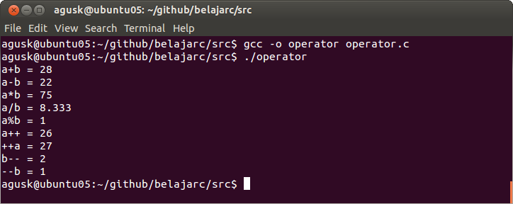

# Operator

Pada sesi ini kita akan belajar mengenai operator yang sering digunakan dalam bahasa C. Operator ini meliputi:

* Operator Aritmatika
* Opeator Relational
* Operator Logika
* Operator Bitwise
* Operator Assignment

Masing-masing operator ini akan dibahas.

## Operator Aritmatika

Operator Aritmatika digunakan untuk melakukan hal-hal yang berhubungan dengan operasi Aritmatika seperti penjumlah, pengurangan, perkalian dan pembagian. Berikut beberapa operator Aritmatika yang dapat digunakan:

* + untuk penjumlah
* - untuk pengurangan
* * untuk perkalian
* / untuk pembagian
* % untuk menghasilkan sisa dari pembagian (sisa bagi)
* ++ untuk menjumlah dengan angka 1
* -- untuk melakukan pengurangan dengan angka 1

Berikut ini contoh implementasinya ([operator.c](../src/operator.c)):

    #include <stdio.h>

    int main()
    {
        int a = 25, b = 3;

        int c = a + b;
        printf("a+b = %d \n", c);

        c = a - b;
        printf("a-b = %d \n", c);

        c = a * b;
        printf("a*b = %d \n", c);

        float d = (float)a / b;
        printf("a/b = %.3f \n", d);

        c = a % b;
        printf("a%%b = %d \n", c);

        a++;
        printf("a++ = %d \n", a);

        ++a;
        printf("++a = %d \n", a);

        b--;
        printf("b-- = %d \n", b);

        --b;
        printf("--b = %d \n", b);

    	return 0;
    }

Untuk kompilasi dan eksekusinya:

    $ gcc -o operator operator.c
    $ ./operator

Jika sukses kita akan mendapatkan tampilan seperti dibawah ini.

## Operator Relational

## Operator Logika

## Operator Bitwise

## Operator Assignment

