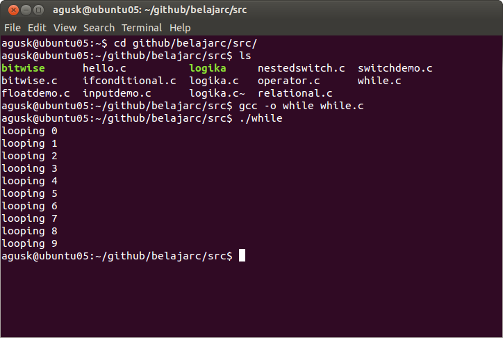

# Pengulangan

Suatu ketika kita membuat potongan kode program dan potongan kode program ini harus dilakan sebanyak 15 kali. Hal yang dilakukan adalah melakukan salin dari potongan kode program sebanyak 15 kali. Namun keputusan ini menjadi buruk ketika kita melakukan pengulangan sebanyak seribu!!.

Unuk menangani ini, bahasa C menyediakan solusi untuk pengulangan dengan menyediakan sintak khusus. Pada bahasa C kita dapat melakukan pengulangan dengan memanfaatkan 3 sintak berikut ini

* while
* do..while
* for

Masing-masing pengulangan ini akan dibahas pada sesi berikutnya.

## while

Sintak dasar dari while dapat dideklarasikan sebagai berikut.

    while(ekspresi) {
    
        // melakukan sesuatu

    }

Sebagai ilustrasinya, kita akan melakukan looping sebanyak 10 kali. Berikut ini contoh programnya ([while.c](../src/while.c)).

    #include <stdio.h>
     
    int main ()
    {
    
       int a = 0;
    
       while(a<10)
       {
           printf("looping %d \n",a);
           a++;
       }
          
       return 0;
    }
    

Simpan kode program ini dan lakukan kompilasi serta menjalankannya.

    $ gcc -o while while.c
    $ ./while
    

Contoh hasil eksekusinya

## do..while

Kalau pada sintak while, kita melakukan pengecekan ekspresi dan jika terpenuhi maka proses akan dilanjutkan pada kode program selanjutnya. Sedangkan pada do..while, proses pengecekan ekspresi dilakukan diakhir. Berikut ini sintak dasar do..while.

    do
    {
        // lakukan sesuatu
    
    }while(ekspresi);

Contoh ilustrasi kita ambil dari kode program while tetapi disini kita menggunakan do..while ([dowhile.c](../src/dowhile.c)).

    #include <stdio.h>
     
    int main ()
    {
    
       int a = 0;
    
       do
       {
           printf("looping %d \n",a);
           a++;
       }while(a<10);
          
       return 0;
    }

Lakukan kompilasi dan jalankan.

    $ gcc -o dowhile dowhile.c
    $ ./dowhile
    

## for

Selain menggunakan while dan do..while, kita juga dapat melakukan pengulangan dengan menggunakan for. Secara umum sintak for sebagai berikut:

    for(initialisasi;kondisi;peningkatan/penurunan nilai)
    {
        // lakukan sesuatu
    }

Sebagai contoh skenario, kita melakukan looping sebanyak 15 ([for.c](../src/for.c)).

    #include <stdio.h>
     
    int main ()
    {
        int i;
    
        for(i=0;i<15;i++)
        {
            printf("looping %d \n",i);
        }
    
          
       return 0;
    }

Lakukan kompilasi dan jalankan.

    $ gcc -o for for.c
    $ ./for
    

Berikut ini contoh hasil eksekusinya.

## Nested Looping

Pada beberapa kasus kita juga dapat melakukan nested looping, contohnya sebagai berikut.

    int i,j;
    
    for(i=0;i<8;i++)
        for(j=0;j<5,j++)
        {
            printf("looping %d %d \n", i, j);
    
        }

