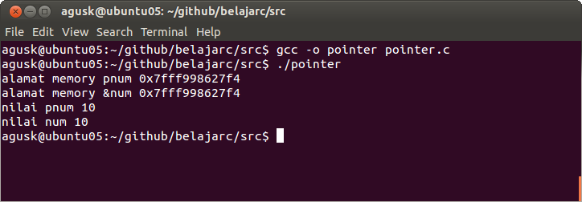
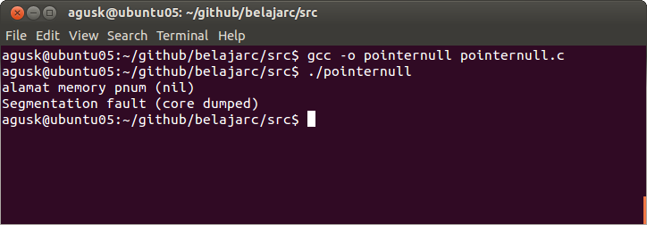

# Pointer

## Deklarasi Pointer

Pointer adalah suatu variabel yang nilainya pada alamat variabel tertentu. Jadi pointer hanya menyimpan alamat dari nilai variabel tersebut. Seperti hal variabel lainnya, sebuah pointer juga harus dideklarasikan terlebih dulu. Secara umum sintaknya sebagai berikut:

    tipe_variabel *nama_varibel;

Contoh realisasinya pada kode program:

    int *num;
    char *str;
    float *values;

## Pengunaan Pointer

Untuk memudahkan pemahaman, kita akan langsung menggunakan pada kasus sederhana. Disini kita memilih dua variabel. Satu adalah int dan satunya adalah int pointer. Kemudian nilai dari variabel tipe int dimasukkan kedalam variabel tipe int pointer.

Perhatikan kode program dibawah ini ([pointer.c](../src/pointer.c)).

    #include <stdio.h>
     
    int main ()
    {
        int num = 10;
        int *pnum;
    
        pnum = &num; // num memberikan alamat memory ke pnum
        // check alamat memory. Hasilnya akan sama
        printf("alamat memory pnum %p \n", pnum);
        printf("alamat memory &num %p \n", &num);
    
        // menampilkan nilai pnum
        printf("nilai pnum %d \n", *pnum);
        printf("nilai num %d \n", num);
          
       return 0;
    }

Simpan kode program ini dan jalankan.

    $ gcc -o pointer pointer.c
    $ ./pointer
    

Contoh hasil eksekusinya dapat dilihat dibawah ini.

## NULL Pointer

Pointer null dideklarasikan sebagai pointer yang alamatnya null/nill. Ini berguna untuk initialisasi pointer. Berikut ini contoh penggunaannya ([pointernull.c](../src/pointernull.c)):

    #include <stdio.h>
     
    int main ()
    {    
        int *pnum = NULL;
    
        // check alamat memory
        printf("alamat memory pnum %p \n", pnum);
    
        // menampilkan nilai pnum
        printf("nilai pnum %d \n", *pnum);    
          
       return 0;
    }

Lakukan kompilasi dan eksekusi

    $ gcc -o pointernull pointernull.c
    $ ./pointernull
    
Dan berikut ini contoh hasil eksekusinya:

Terlihat terjadi error ketika mengakses nilai yang alamatnya nill atau null.

