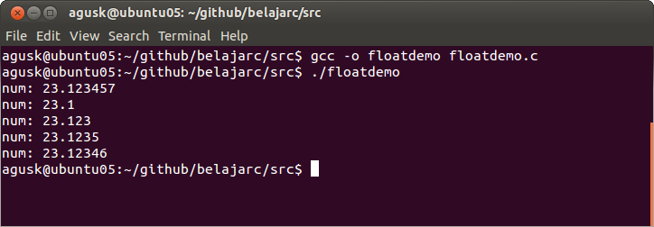

# Menampilkan Text ke Layar

## Menampilkan Text ke Layar

Seperti yang pernah dibuat pada Hello World dimana kita menampikan ke layar. Disini kita menggunakan printf(). Contoh sintaknya:

    printf("Selamat datang di C");

Jika ingin setelah menampilkan tulisan tersebut, kursor diarahkan ke kiri bawah maka kita dapat menambahkan "\r\n", contoh penggunaannya:

    printf("Selamat datang di C \r\n");
    
    
## Menyisipkan karakter atau Bilangan

Misalkan kita ingin menampilkan nilai temperatur yang diperolah dari pengukuran dan menampikan ke layar.

    int temperatur = 10; // bisa dari hasil pengukuran
    printf("Temperatur: %d \r\n", temperatur);
    
Anda perhatikan nilai %d menunjukkan suatu bilangan yang akan disisipkan. Berikut ini yang perlu diketahui.
* %d dan %i digunakan untuk bilangan int
* %x untuk menampilkan bilangan hex
* %o untuk menampilkan bilangan octal
* %s untuk string
* %f untuk decimal floating point

## Menampilkan Bilangan Decimal/Float

Kadangkalanya kita mendapat suatu bilangan decimal/float yang angka dibelakang komanya banyak dan kita ingin menampilkan sesuai dengan keinginan berapa banyak angka desimalnya. Perhatikan kode program dibawah ini.

    #include <stdio.h>

    int main()
    {
        float num = 23.123456789023;

        printf("num: %f \n",num);
        printf("num: %.1f \n",num);
        printf("num: %.3f \n",num);
        printf("num: %.4f \n",num);
        printf("num: %.5f \n",num);

    	return 0;
    }

Kode program diatas dapat diunduh disini [floatdemo.c](../src/floatdemo.c).
Kalau kita lakukan kompilasi dan eksekusi.

    $ gcc -o floatdemo floatdemo.c
    $ ./floatdemo

Contoh hasil eksekusinya dapat dilihat dibawah ini.

